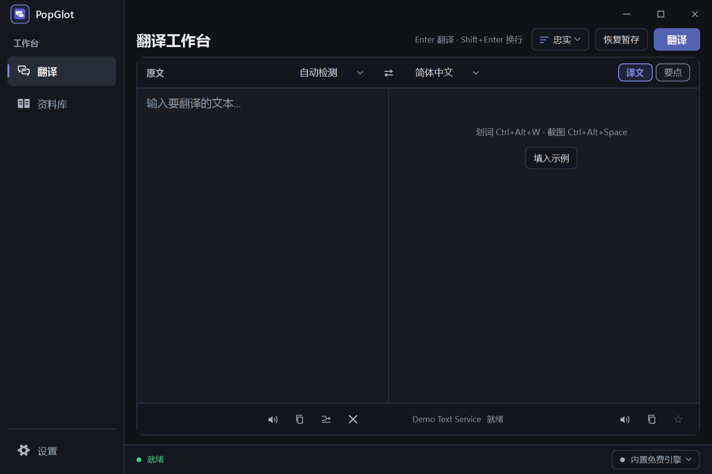
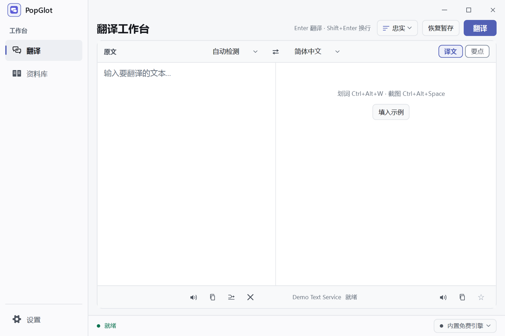
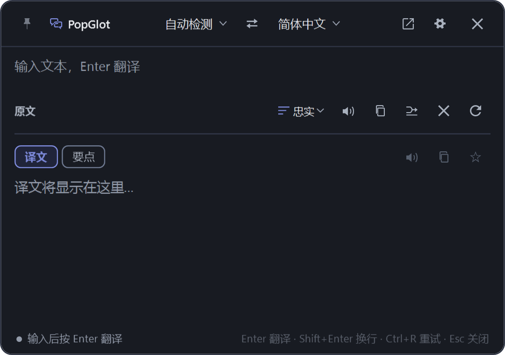
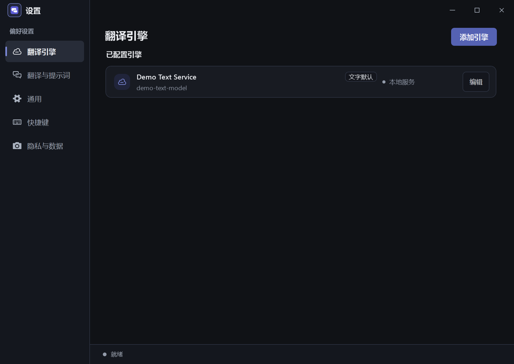

# PopGlot

[](https://github.com/ethan-blue/PopGlot/releases)
[](CHANGELOG.md)
[](LICENSE)
[](https://github.com/ethan-blue/PopGlot/actions)

Windows 划词和截图翻译。选中报错、注释、命令或文档，按快捷键，译文出现在光标旁边。

A Windows desktop translator for selected text and screenshots. It is meant for error messages, comments, commands and technical docs.

中文说明在上，English follows each section.

| 深色工作台 | 浅色工作台 |
| --- | --- |
|  |  |

图中的 “Demo Text Service” 是测试数据，不是内置服务。The “Demo Text Service” label in the pictures is test data, not a built-in provider.

## 能做什么

| | |
| --- | --- |
| 划词 | 任意程序里选中文字，`Ctrl+Alt+W`。原剪贴板会按序列号恢复，不会盖掉你后来复制的内容。 |
| 截图 | `Ctrl+Alt+Space` 框选。默认识别在本机完成。只有你允许图片离开本机时，才会把截图交给视觉模型。 |
| 工作台 | `Ctrl+Alt+O`。左边原文，右边译文。译文下面是说明；「要点」是另一种阅读，不会清掉译文。 |
| 查词 | `Ctrl+Alt+Q`。输入后按 Enter 翻译。 |
| 引擎 | OpenAI 兼容、OpenAI Responses、Anthropic、Gemini，以及 Ollama、LM Studio 这类本机地址。 |
| 免费线路 | 未配置自己的引擎时，可在授权后使用 Google 公共翻译。Google 不可用时，可改选 MyMemory。一次只发给你选中的那一条。 |
| 外观 | 设置 → 通用。跟随系统、浅色、深色，点选后立即预览。 |
| 离线 | 「安全离线模式」打开后，包括免费线路在内的外发请求都不会发出。本机模型地址仍可用。 |

Select text anywhere and press `Ctrl+Alt+W`. Frame a screenshot with `Ctrl+Alt+Space`. The main window (`Ctrl+Alt+O`) keeps the translation and a separate summary, so one does not erase the other. Keys stay in Windows Credential Manager, one entry per engine.

## 界面

划词浮窗贴在光标旁。结果先出译文，说明附在下面。

The selection panel sits next to the cursor. The translation stays; the note sits under it.



主题在「设置 → 通用」，三张色样是跟随系统、浅色、深色。点下去马上换外观，按保存后下次启动还用这一项。下图是设置里的翻译引擎页，不是主题页。

Appearance is under Settings → General: system, light, or dark. The picture below is the engine page, not the theme page.



## 第一次使用

1. 解压后运行 `PopGlot.exe`。窗口不自动弹出，图标在任务栏通知区域。
2. 选中一段英文，按 `Ctrl+Alt+W`。
3. 若还没有自己的引擎，到「设置 → 隐私与数据」允许免费线路。未允许时不会发出请求。
4. 要换模型：设置 → 翻译引擎 → 添加引擎。填地址和密钥，测试连接，再设为默认。

Run `PopGlot.exe`. It stays in the tray. Allow the free engine under Settings → Privacy before the first request, or add your own engine.

默认快捷键：

| 动作 | 快捷键 |
| --- | --- |
| 划词翻译 | `Ctrl+Alt+W` |
| 截图翻译 | `Ctrl+Alt+Space` |
| 关闭浮窗 | `Ctrl+Alt+X` |
| 打开主窗口 | `Ctrl+Alt+O` |
| 查词 | `Ctrl+Alt+Q` |

`Esc` 第一次取消当前请求，再按一次关闭浮窗。快捷键可以在设置里重录；和系统已占用的组合冲突时，会退回保存前的组合。

## 数据放在哪里

配置在 `%LOCALAPPDATA%\PopGlot`。

| 文件 | 内容 |
| --- | --- |
| `provider-settings.json` | 当前文字和图片线路，schema v3。不含密钥。 |
| `product-config.json` | 已添加的引擎列表，schema v7。 |
| `prompt-templates.json` | 翻译风格。只在本机。 |
| `windows-shell.json` | 快捷键、主题、免费线路授权。 |
| `history.json` | 历史。最多 200 条、90 天、4 MiB。半成品不写入。 |

密钥在 Windows 凭据管理器，名称是 `PopGlot/provider/<引擎 id>`。日志不记原文、截图和密钥。

更细的边界见 [隐私说明](docs/help/privacy-and-security.md)。应用内的其余说明在 [docs/help](docs/help/index.md)。

## 下载

需要 Windows 10（19041 及以上）或 Windows 11，64 位。

[下载 PopGlot 0.1.8](https://github.com/ethan-blue/PopGlot/releases/download/v0.1.8/PopGlot-v0.1.8-win-x64.zip)

每一版的发布页都用同一个样子：标题是 `PopGlot 版本号`，页上直接写这一版改了什么，并附上 zip 和 `.sha256`。不用再点进另一份说明。

| 版本 | 包里有没有 .NET |
| --- | --- |
| 0.1.2 及以后 | 有。解压后运行 `PopGlot.exe`。 |
| 0.1.1 及以前 | 没有。要先安装 .NET 10 Desktop Runtime（x64）。 |

文件名始终是 `PopGlot-v版本号-win-x64.zip`。校验：

```powershell
(Get-FileHash -Path .\PopGlot-v0.1.8-win-x64.zip -Algorithm SHA256).Hash.ToLower()
Get-Content .\PopGlot-v0.1.8-win-x64.zip.sha256
```

全部发布页在 [Releases](https://github.com/ethan-blue/PopGlot/releases)。

## 版本怎么编号

`主版本.次版本.修订号`。已打 tag 的编号不重用、不跳号。工作区还没提交时，下一版就是最近 tag 加 1；同一轮里继续修改，仍然写在这一个编号上。

规则和一条说明该怎么写，见 [docs/VERSIONING.md](docs/VERSIONING.md)。已发布的变化见 [CHANGELOG.md](CHANGELOG.md)。

## 从源码构建

Windows 11 x64，Rust stable（`x86_64-pc-windows-msvc`），Visual Studio Build Tools 2022，.NET 10 SDK，PowerShell 7。

```powershell
./scripts/verify.ps1
./scripts/run.ps1
```

`verify.ps1` 会跑 Rust 测试、Clippy、WPF 构建，以及两组 Windows 测试。WPF 工程会自己编译 `popglot-ffi`，并把 `popglot_ffi.dll` 拷到输出目录。

离线延迟测量：

```powershell
cargo run -p popglot-core --bin stream_benchmark -- --scenario all --validate --tolerance-ms 40
```

在线测量默认不发出请求。要打到真实服务，必须同时加上 `--live` 和 `--i-understand-cost`，密钥放在环境变量 `POPGLOT_BENCHMARK_API_KEY`，不要写进命令行。说明见 [docs/TRANSLATION_BENCHMARK.md](docs/TRANSLATION_BENCHMARK.md)。

代码分成四块：WPF 外壳在 `apps/PopGlot.Windows`，领域类型在 `crates/popglot-domain`，翻译和路由在 `crates/popglot-core`，C ABI 在 `crates/popglot-ffi`。外壳可以换，翻译内核不跟着重写。结构见 [ARCHITECTURE.md](ARCHITECTURE.md)，范围见 [PRODUCT_SPEC.md](PRODUCT_SPEC.md)。

## 许可

[MIT](LICENSE)。
