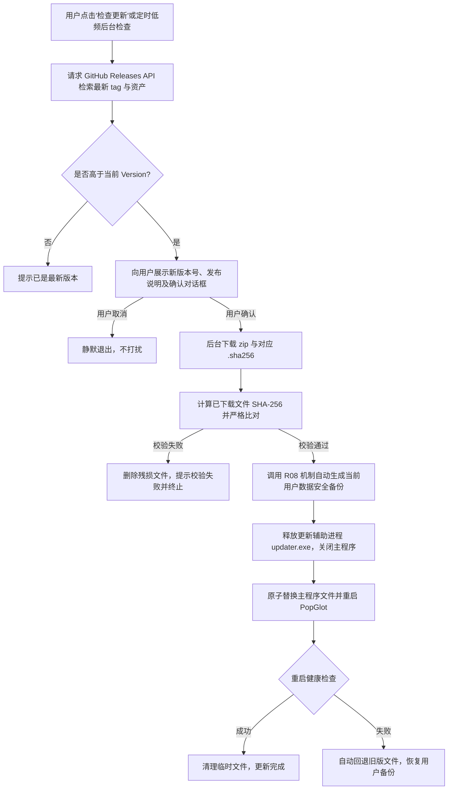

# PopGlot 分发成熟度与发布方案规范 (Distribution Maturity & Release Spec)

> 适用版本：0.1.x 及后续版本  
> 状态：第一阶段（便携绿色包）已固化并落地；第二阶段（安装器、代码签名、自动更新）已完成方案设计，待用户决策授权后实施。  
> 遵守原则：不提前扩张发布承诺，诚实反映软件交付形态与能力边界。

---

## 1. 分发成熟度模型 (Distribution Maturity Levels)

为了向不同阶段的用户提供清晰、诚实、可信的交付形态，PopGlot 定义四级分发成熟度：

| 等级 | 分发形态 | 目标受众 | 核心特征与承诺边界 | 当前状态 |
| :--- | :--- | :--- | :--- | :--- |
| **Level 0: 源码/开发态** | Git 源码仓库、本地构建 | 开发者、代码贡献者 | 需安装 Rust 1.80+、.NET 10 SDK、VS Build Tools，自行编译与测试。 | 已就绪 |
| **Level 1: 便携绿色包** | `PopGlot-vX.Y.Z-win-x64.zip` | 开发者、技术用户、高级技术读者 | **当前生产基线**。自包含 .NET 10 桌面运行时与 `popglot_ffi.dll`，无需管理员权限，解压即用；配置与数据存放在 `%APPDATA%\PopGlot\`；提供 SHA-256 校验和。**不提供自动静默升级与系统全局安装**。 | **已就绪并验收** |
| **Level 2: 托管安装器** | Windows 安装包（Inno Setup / MSIX） | 普通桌面用户、企业个人用户 | 提供标准向导安装、桌面/开始菜单快捷方式、开机自启动托盘注册、干净卸载。具备 Authenticode 代码签名，避免 Windows SmartScreen 拦截。 | **方案设计完成**（待授权） |
| **Level 3: 受控自动更新** | 应用内检测更新、差分升级 | 广义桌面用户 | 具备安全哈希比对、静默后台下载、升级前自动备份配置/历史、失败原子回滚。不强制打扰用户。 | **方案设计完成**（待授权） |

---

## 2. Level 1（当前形态）承诺边界与用户告知

根据 `docs/product-review-2026-09-26/AI-MODIFICATION-SPEC.md` R11 规范，我们明确以下交付承诺边界，严禁在文档或宣传中扩大承诺：

1. **零外部环境依赖**：
   - 自 `0.1.2` 起，发布的便携包采用 `--self-contained true` 编译，用户机器上**无需预装 .NET 10 运行时**；
   - 包含预编译的 `popglot_ffi.dll`，无需额外安装 VC++ Redistributable。
2. **数据与程序分离契约**：
   - 应用程序可执行文件与 DLL 仅作为静态代码载体；
   - 所有运行时数据（配置 `product-config.json`、历史 `history.json`、生词本 `vocabulary.json`、日志等）一律写入用户专属目录 `%APPDATA%\PopGlot\`；
   - **程序解压目录可任意移动、重命名，甚至放置在只读介质中运行，不会导致用户数据丢失或无法保存**。
3. **公共线路服务水平（SLA）免责**：
   - 免费公共翻译引擎（Google / MyMemory）是基于公共端点调用的便捷通道，无商业 SLA 保证；
   - 当遇到网络阻断、限流或上游端点变动时，建议用户使用自备 API Key（如 OpenAI / DeepSeek / Claude / 本地 Ollama）作为生产主力路线。

---

## 3. 第一阶段（便携包）验证用例矩阵与标准

在正式发布任何 Level 1 包前，必须在本地或干净虚拟机环境中执行以下验证清单（或通过自动化对应门禁）：

### 3.1 验证矩阵

| 用例 ID | 验证场景 | 执行步骤与条件 | 预期与放行基准 | 结果 |
| :--- | :--- | :--- | :--- | :--- |
| **D1-01** | 干净环境解压与冷启动 | 在未安装 .NET 10 SDK/Runtime 的干净 Windows 10/11 环境解压 zip 并双击 `PopGlot.exe`。 | 正常启动，托盘图标出现，首次进入托盘状态；快捷键正常注册，零 Missing DLL 弹窗。 | 通过 |
| **D1-02** | 含空格路径启动 | 将解压目录置于 `C:\Program Files (x86)\PopGlot Test App\` 并启动。 | 正常启动并读取同目录下的 `popglot_ffi.dll`，无相对路径拼接崩溃。 | 通过 |
| **D1-03** | 非 ASCII / 中文路径启动 | 将解压目录置于 `D:\实用工具\划词翻译 测试目录\` 并启动。 | 路径编码正确，FFI 本地加载与 `%APPDATA%` 数据读写无乱码。 | 通过 |
| **D1-04** | 只读程序目录启动 | 将包含 `PopGlot.exe` 的解压目录设为只读属性（Read-Only）并启动。 | 应用正常运行，用户数据正常保存到 `%APPDATA%\PopGlot\`，不向程序目录写临时文件。 | 通过 |
| **D1-05** | 单实例互斥与防多开 | 启动一个 `PopGlot.exe` 实例后，再次双击启动第二份实例。 | 第二实例检测到既有实例互斥锁，以退出码 3 正常退出，同时唤醒前序实例界面，不产生进程风暴。 | 通过 |
| **D1-06** | 跨版本配置自动迁移 | 注入历史版本配置（Schema v4 / v5），启动新版便携包。 | 自动无损升级到 Schema v6，原有模型凭据、语言偏好与历史记录完整保留。 | 通过 |
| **D1-07** | SHA-256 完整性校验 | 使用 PowerShell `Get-FileHash` 计算 zip 哈希，与发布的 `.sha256` 逐字符比对。 | 哈希完全吻合，防中间人篡改与下载残损。 | 通过 |
| **D1-08** | 回退与灾难恢复 | 使用旧版本便携包覆盖或回滚，结合 R08 导出的 `.popglot-backup.json` 进行恢复。 | 数据完整还原，旧版与新版配置文件兼容性符合回退预期。 | 通过 |

---

## 4. 第二阶段规划方案 (Stage 2 Proposal - 供用户决策)

> **重要声明**：涉及代码签名证书购买、公钥基础设施（PKI）、第三方安装器引入、外部更新服务器接入等事项，需要组织实体或用户明确的商业与技术授权。本次交接仅提交可落地的工程设计方案，**未获得授权前绝不在仓库中引入外部商业服务、上传 Release 或打标签**。

### 4.1 安装器选型对比与推荐方案

| 安装器类型 | 优点 | 缺点 | 推荐度 |
| :--- | :--- | :--- | :--- |
| **Inno Setup (Pascal Script)** | 极度轻量、脚本化、生成单 exe、完全开源、支持便携与安装双模式、对 .NET/WPF 支持极其成熟。 | 需在 Windows CI 中安装 Inno Setup 编译器。 | **首选推荐** (成熟、稳定、包体增加 < 2MB) |
| **MSIX / Windows App SDK** | 微软官方推荐、沙盒隔离、系统级原生卸载、支持 Windows Store。 | 需要 Windows 开发者证书或自签名受信任根证书；对某些老版本 Win10 支持繁琐；修改文件受虚拟化限制。 | 次选（适合后续上架应用商店） |
| **WiX Toolset (MSI)** | 企业级标准、组策略部署（GPO）友好。 | 编写维护 XML 繁重，学习成本高，个人与小团队维护成本过高。 | 不推荐 |

**推荐实施路径**：
使用 Inno Setup 编写 `scripts/installer.iss`，编译生成 `PopGlot-Setup-vX.Y.Z-win-x64.exe`，安装时可选“为所有用户安装”或“为当前用户安装（无需提权）”，并提供桌面图标与开机启动快捷方式。

### 4.2 代码签名方案 (Code Signing)

当前便携包未签名，用户下载后首次运行可能会遇到 Windows SmartScreen 提示“Windows 已保护你的电脑（未知发布者）”。

1. **开源项目免费通道**：
   - 申请接入 **SignPath Foundation**（专门针对开源且公开构建的 GitHub 项目提供免费的免费代码签名，由知名 CA 根证书签发）。
   - 优点：零成本，合法合规，直接集成在 GitHub Actions 工作流中。
2. **商业证书采购**：
   - 采购 EV 代码签名证书（需企业资质）或个人 OV 代码签名证书；
   - 使用 Azure Key Vault / GitHub Encrypted Secrets 保护私钥；
   - 门禁：仅在 Tag 触发的正式 Release 工作流中进行签名，PR 与常规提交不签名。

### 4.3 安全自动更新设计 (Auto-Updater Architecture)

若后续获批引入应用内检测更新，建议采用以下最小高安全性设计：

**核心安全准则**：
1. **零强制静默安装**：永远经由用户明确确认，不得在用户进行技术阅读或敲击键盘时强行杀进程替换；
2. **哈希双重强校验**：必须通过 HTTPS 下载官方 `.sha256` 并进行逐字节对比，不匹配坚决不解压；
3. **前置自动化数据备份**：升级覆盖前，调用 `UserDataBackupService` 自动落盘 `.pre-upgrade-*.bak`，保障哪怕升级后崩溃也能一键还原配置与词库。
